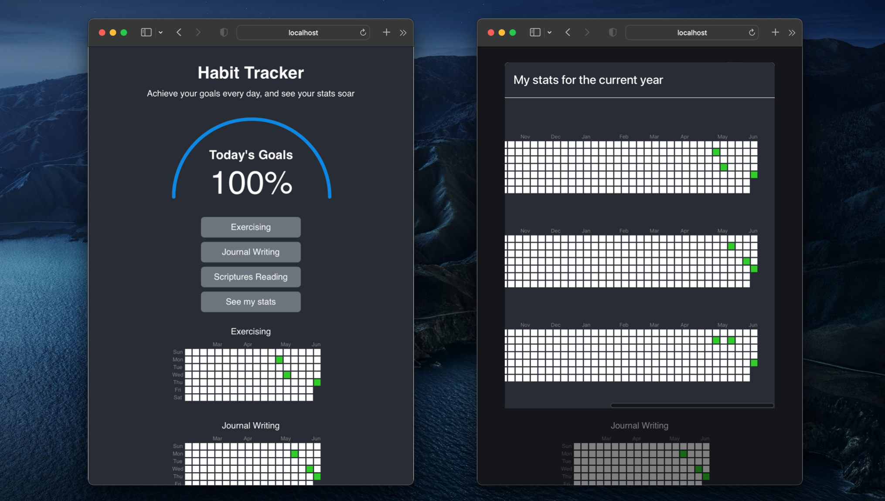

# Overview

The purpose of the *Habit Tracker* web application is to help you with maintaining good habits to reach your goals through gamification (turning goals into a game). This software retrieves information saved in a cloud database and shows a calendar with daily goals achieved per each habit you are building. Also, the program allows you to report completed goals for the current day through a minimalistic interface.

# How it works

The *Habit Tracker* web app relies on Django and React for the backend and frontend parts, respectively. By using the Boto3 Python package, the backend connects to a [AWS DynamoDB](https://docs.aws.amazon.com/dynamodb/) table to retrieve information and sends the processed data to the frontend for visualization and interaction purposes. The frontend will capture new entries from the user and will ask the backend to send that information back to the cloud database. The interface has been designed to show on the screen updated information from the cloud service using a progress bar for the current day and calendars to have overall visuals of the accomplishements.

A demonstration of the software running and a walkthrough of the code can be found [here](https://youtu.be/eHJdCw4zRY0).

<!-- Detailed specifications of this program can be found [here](). -->

# Web Pages

## React frontend

* `http://localhost:3000/`: The main web page can be oppened using the default React URL address. It has the following sections:
    * Header overall information
    * A progress circle showing the percentage of the today's accomplishements. It will automatically update whenever the user reports a completed task.
    * A group of buttons to update today's goals. For example, pressing the button `Journal writing` will indicate that this task has been finished and the app will save that information in the cloud database. The last button `See my stats` will pop up a React modal displaying the current-year achievements calendar for each habit.
    * Small calendars for each habit for the last couple of months



## Django backend

* `http://localhost:8000/`: The default Django URL address hosts a web page showing a simple header.
* `http://localhost:8000/api/`: A communication channel between the backend and the frontend. Used for sending cloud database information as a JSON object to the frontend.
* `http://localhost:8000/api/updateDB/`: Used for sending completed task information from the frontend to the backend. The Django `rest_framework` package was used for the implementation of this API endpoint.

## Communication

The Django backend URLs were defined in `atomic/urls.py` which calls functions from the `atomic/views.py`. Django looks for paths for this `atomic` application in `habit_tracker/urls.py` (parent directory is `backend/`).

To allow communication between the backend and frontend for this project, the package `corsheaders` needed to be installed, and the following information was required in the `habit_tracker/settings.py` file:

```python
CORS_ORIGIN_WHITELIST = [
     "http://localhost:3000", # default URL for React frontend
]
```

```python
INSTALLED_APPS = [
    ...,
    "corsheaders",
]
```

```python 
MIDDLEWARE = [
    ...,
    "corsheaders.middleware.CorsMiddleware",
]
```

# How to use it

Clone this repository

```ShellSession
$ git clone https://github.com/chinchay/habit-tracker.git
```

Assuming `Python`, `Django` and `npm` (a JavaScript package manager) are installed in your system:

Run Django
```ShellSession
$ cd habit-tracker/backend/
$ python manage.py runserver
```

Install the required React modules for this project
```ShellSession
$ cd habit-tracker/frontend/
$ npm install
```

Run React
```ShellSession
$ cd habit-tracker/frontend/
$ npm start
```

The web app will be displayed in the React default URL `http://localhost:3000`


# Development Environment

* __Editor__: Visual Studio Code
* __Languages__: Python 3.10.5 and JavaScript
* __Version control system__: Git
* __Cloud repository__: GitHub
* __Frameworks__: [Django](https://www.djangoproject.com/) (as backend) and [React](https://react.dev/) (as frontend)
* __Python packages__: [Boto3](https://github.com/boto/boto3)
* __Django packages__: [corsheaders](https://pypi.org/project/django-cors-headers/) and [rest_framework](https://www.django-rest-framework.org/) (as defined in `backend/habit_tracker/settings.py`)
* __JavaScript package manager__: [npm](https://www.npmjs.com/)
* __React packages__: [react-apexcharts](https://apexcharts.com/docs/react-charts/), [react-bootstrap](https://www.npmjs.com/package/react-bootstrap), [bootstrap](https://getbootstrap.com/), [axios](https://github.com/axios/axios), and [@uiw/react-heat-map](https://uiwjs.github.io/react-heat-map/) (as defined in `frontend/package.json`).

# Useful Websites

__Required reading for building this project__:

* [How To Build a To-Do application Using Django and React](https://www.digitalocean.com/community/tutorials/build-a-to-do-application-using-django-and-react)
* [Build a Django Front End With Bulma](https://realpython.com/django-social-front-end-2/)
* [Build and Submit HTML Forms With Django](https://realpython.com/django-social-forms-4/)
* [Get Started With Django](https://realpython.com/django-user-management/)
* [Django JsonResponse](https://zetcode.com/django/jsonresponse/)
* [Axios vs. fetch()](https://blog.logrocket.com/axios-vs-fetch-best-http-requests/)
* [Calendar heatmap react component](https://reactjsexample.com/a-customizable-calendar-heatmap-react-component-built-on-svg/)
* [React modal](https://react-bootstrap.github.io/docs/components/modal) and [React button](https://react-bootstrap.github.io/docs/components/buttons/)
* [Amazon DynamoDB database](https://us-east-2.console.aws.amazon.com/dynamodbv2/home?region=us-east-2#service)
* [DynamoDB operations performed locally](https://www.youtube.com/watch?v=Al1xwYhQ-BM&ab_channel=SoumilShah)

__Nice to watch__:
* [Deploy Django into Production with Kubernetes, Docker, & Github Actions.](https://www.youtube.com/watch?v=NAOsLaB6Lfc&ab_channel=CodingEntrepreneurs)
* [Upload your Django project to GitHub - The Easy Way](https://www.youtube.com/watch?v=fVy9eJzloj8&ab_channel=CloudWithDjango)
* [Streaming com Python e Django](https://www.youtube.com/watch?v=YsvDurLUCbM&ab_channel=pythonando)


# Future Work

This project was built using ideas from a [previous work](https://github.com/chinchay/cloud-goal-tracker).

The following tasks will be completed in a next phase:

* Modify the program so that the user can define other goals different from the three provided in the current version (see figure above)
* Use an authentication process. Kerberos is a possible choice
* Include other features. Example: Earning points whenever five goals were achieved
* Implement a script in the DynamoDB database to send notifications
* Load this code into a server to receive such notifications and perform other tasks
* Improve the [mobile version](https://github.com/chinchay/cloud-goal-tracker-iOS) using ideas of this project

# Copyright and license

Code released under the MIT License